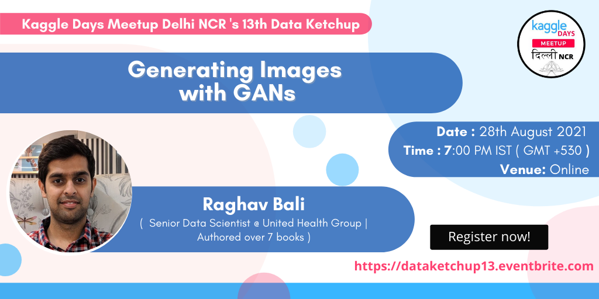

# Data Ketchup: Image Generation with GANs
> A Simple GAN Tutorial

## Details 
+ [Registration Link](https://www.eventbrite.com/e/data-ketchup-13-tickets-167996258331)
+ :alarm_clock: 7pm IST
+ :date: August 28th, 2021

## Agenda
- Machine Learning Landscape
- Generative Modeling
- Generative Adversarial Networks
- [Generate Images : Hands-on](https://github.com/raghavbali/data_ketchup_gans/blob/main/notebooks/vanilla_gan.ipynb.ipynb) :sparkles:
- Progressive GANs
- [Generate Faces with Progressive GAN](https://github.com/raghavbali/data_ketchup_gans/blob/main/notebooks/pro_gan_tfhub.ipynb) :sparkles:
- Challenges

> Content of this talk is derived from the book __[Generative AI with Python and TensorFlow 2](https://www.amazon.in/Generative-AI-Python-TensorFlow-Transformer-ebook/dp/B0922PCNPS/ref=sr_1_1?dchild=1&keywords=generative+ai&qid=1629522690&sr=8-1)__

